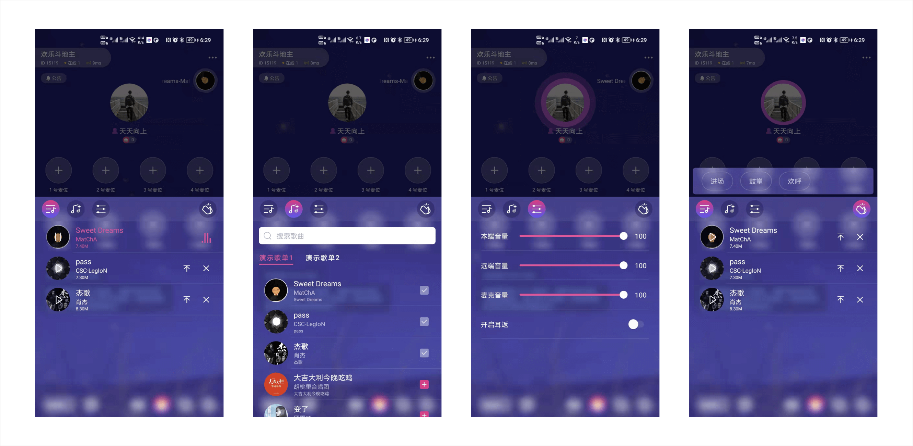

# MusicControlKit 文档

## 在需要弹出音乐控制的地方调用如下方法

```
// 显示音乐弹框
RCMusicControlEngine.getInstance().showDialog(getSupportFragmentManager(), new RCMusicKitListener());
```



## 实现 `RCMusicKitListener` 接口

该接口继承了 `OnMusicDataSourceListener` (数据获取回调)，`OnMusicOperateListener` (音乐操作回调)
, `OnMusicPlayerListener` (音乐控制回调)
三个接口，可以实现具体方法进行音乐控件的数据展示及控制，详细用法见demo中的 [MusicControlManager](../app/src/main/java/cn/rongcloud/kitdemo/musiccontrolkit/MusicControlManager.java)

## 音乐操作 `RCMusicControlEngine`

- 音乐实体类 Music

```java
public class Music<T> implements Serializable {
    /**
     * 音乐服务器地址
     */
    @SerializedName("fileUrl")
    private String fileUrl;
    /**
     * 音乐图片
     */
    @SerializedName("coverUrl")
    private String coverUrl;
    /**
     * 音乐名称
     */
    @SerializedName("musicName")
    private String musicName;
    /**
     * 作者
     */
    @SerializedName("author")
    private String author;
    /**
     * 专辑
     */
    @SerializedName("albumName")
    private String albumName;
    /**
     * 本地文件路径
     */
    @SerializedName("path")
    private String path;
    /**
     * 文件大小（字节）
     */
    @SerializedName("size")
    private long size;
    /**
     * 下载状态
     */
    private LoadState loadState = LoadState.UN_LOAD;
    /**
     * 音乐 id
     */
    @SerializedName("musicId")
    private String musicId;

    /**
     * 拓展字段，可根据业务传入
     */
    private T extra;

    public enum LoadState {
        /**
         * 正在下载
         */
        LOADING,
        /**
         * 已经下载
         */
        LOADED,
        /**
         * 未下载
         */
        UN_LOAD
    }
}
```

- 音乐列表中添加音乐

```
// 批量添加
RCMusicControlEngine.getInstance().addMusicList(List<Music> musicList);

// 单个添加
RCMusicControlEngine.getInstance().addMusic(Music music);
```

- 音乐列表中删除音乐

```
RCMusicControlEngine.getInstance().deleteMusic(Music music);
```

- 播放

```
RCMusicControlEngine.getInstance().playMusic(Music music)
```

- 暂停

```
RCMusicControlEngine.getInstance().pauseMusic()
```

- 停止

```
RCMusicControlEngine.getInstance().stopMusic()
```

- 播放下一首

```
// loop 是否循环列表，默认 false
RCMusicControlEngine.getInstance().playNextMusic(boolean loop)
```

- 置顶

```
/**
 * 置顶音乐
 * 这里置顶的逻辑是：把要操作的歌曲移到正在播放歌曲的下面，
 * 如果当前没有正在播放的歌曲则播放该歌曲，位置不变化
 */
RCMusicControlEngine.getInstance().topMusic(Music music)
```

- 获取播放列表数据

```
RCMusicControlEngine.getInstance().getMusicList();
```

- 是否正在播放

```
RCMusicControlEngine.getInstance().isPlaying();
```

- 获取正在播放的音乐

```
RCMusicControlEngine.getInstance().getPlayingMusic();
```

- 重置监听和数据

```
RCMusicControlEngine.getInstance().release();
```

