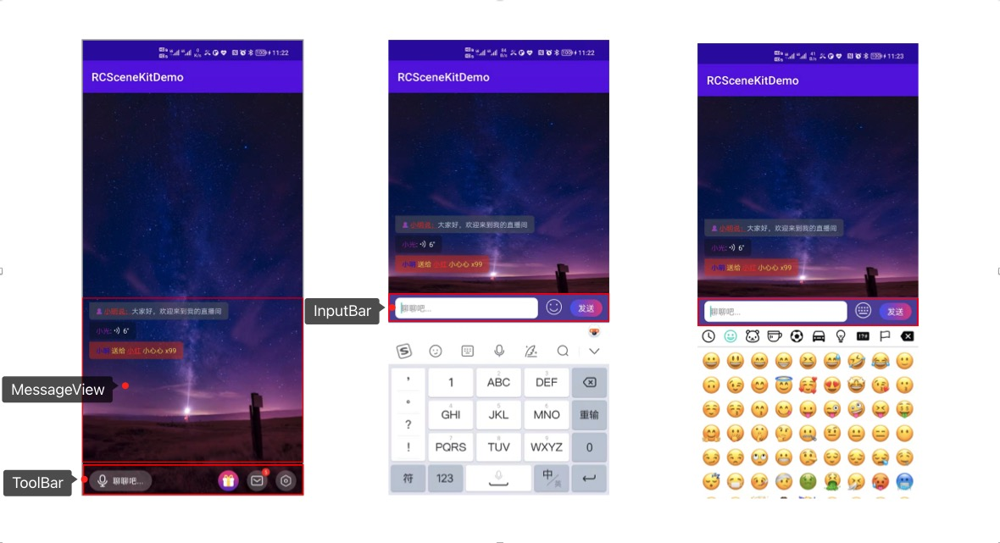

# Android Scene Kit 文档

## Kit项目结构

该项目为demo展示项目，其中 `rccorekit-android` `rcchatroomkit-android` `rcmusiccontrolkit-android`
为submodule方式集成，拉取完项目后，请执行 `git submodule update --init --recursive` 拉取子项目

- `app` ：各个Kit的demo展示，可直接运行体验Kit效果
- `CoreKit` ：Kit的基础库，主要负责初始化Kit，网络加载Json文件或本地 Json 文件等，优先下载远端配置，远端拉取失败或者未配置 AppKey 的情况下采用本地配置。
- `ChatRoomKit` ：语聊房 Kit，封装了消息列表、底部工具栏、输入框等。
- `MusicControlKit` ：背景音乐 Kit ,封装了音乐列表，添加音乐，音乐音量调整，氛围音效等功能。

## Kit可配置项说明

每个Kit项目默认在 `assets` 文件夹下有一份 `${KitName}.json` 文件（如：ChatRoomKit.json/MusicControl.json）
，如果想修改默认配置，可以复制该json文件做修改，然后放到自己项目的 `assets` 文件夹下，注意文件名不要修改。

## Kit 初始化

```java
public class MyApplication extends Application {

    public static MyApplication app;

    @Override
    public void onCreate() {
        super.onCreate();
        app = this;

        // 初始化 Kit，优先根据 appkey 从远端下载配置，不成功采用默认配置
        RCSceneKitEngine.getInstance().initWithAppKey(this, "appkey");
    }
}
```

## ChatRoomKit 文档及示例

### [文档](https://github.com/rongcloud/rcchatroomkit-android)

### 示例



## MusicControlKit 文档及示例

### [文档](https://github.com/rongcloud/rcmusiccontrolkit-android)

### 示例


## 其他

如有任何疑问请提交issue

